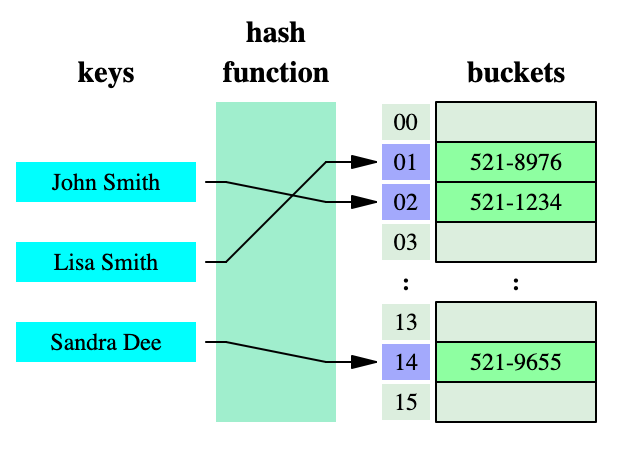
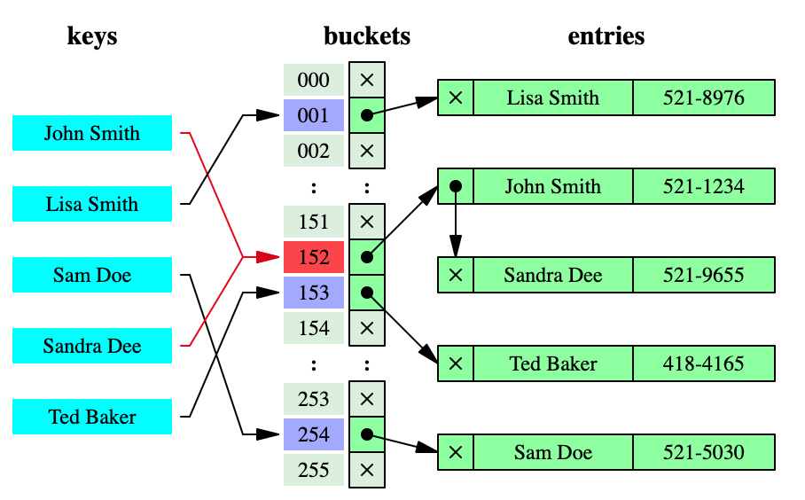

# Hash Table
In computing, a hash table (hash map) is a data structure which implements an associative array abstract data type, a structure that can map keys to values. A hash table uses a hash function to compute an index into an array of buckets or slots, from which the desired value can be found. Under the hood, hash tables aren't just arrays. They're arrays where each index maps to a linked list of potential values. This is to take care of has collisions. Each node in the linked list points back to the original key, otherwise we wouldn't be able to associate node values with keys.

Ideally, the hash function will assign each key to a unique bucket, but most hash table designs employ an imperfect hash function, which might cause hash collisions where the hash function generates the same index for more than one key. It is possible to have one linked list with all N nodes colliding - this is the worst case scenario. Such collisions must be accommodated in some way.

Hash collisions are resolved by separate chaining.

Popular hash functions in use significantly reduce hashing collisions. Industry generally accepts O(1) insert/delete/search complexity.

## Complexities
| Access    | Search    | Insertion | Deletion  | Comments  |
| :-------: | :-------: | :-------: | :-------: | :-------- |
| n         | n         | n         | n         | In case of perfect has function costs would be O(1)          |